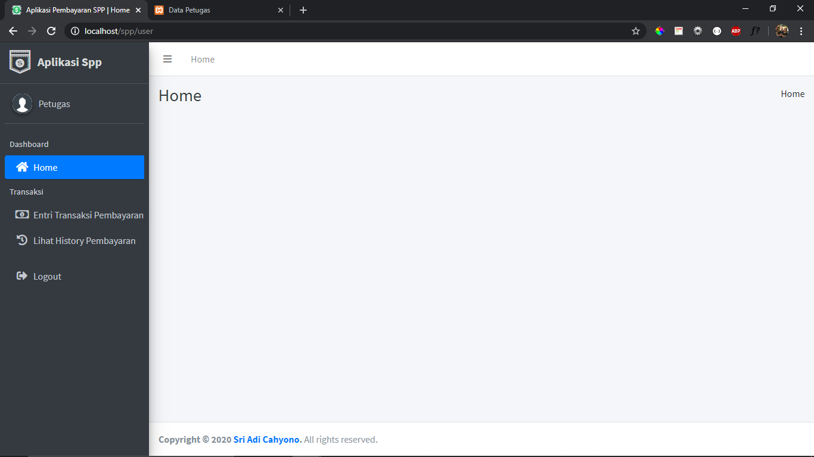

# Source Code aplikasi pembayaran spp

Aplikasi ini dibuat dengan berbagai tools :
* _PHP versi 7.3.11_
* _CodeIgniter 3.1.10_
* _Bootstrap versi 4.3.1_
* _Apache Server_
* _Mysql Server_
* _Fontawesome versi terbaru_
* _dataTable_
* _SweetAlert_

### Tentang Aplikasi
Dalam aplikasi ini terdapat 3 lever user yaitu
- admin
- petugas
- siswa
---

aplikasi ini juga sudah terdapat [SweetAlert](https://sweetalert2.github.io)

Dan untuk menu di dalam setiap level tersebut berbeda.

1. #### Untuk Halaman admin

__Home__

Dalam halaman home admin ini terdapat 4 card untuk mengetahui jumlah data yang ada pada setiap masterdata.

__Master Data__

Dalam halaman master data ini terdapat beberapa submenu untuk setiap data yang ada.

__Entri Transaksi Pembayaran__

Dalam menu ini admin dan petugas saat akan melakukan transaksi pembayaran terlebih dulu mencari nisn siswa dan akan tampil table tagihan yang harus dibayar oleh siswa.h-100

__History Pembayaran__

Sama hal nya seperti entri transaksi admin / petugas terlebih dulu mencari nisn siswa untuk melihat tagihan yang sudah di bayar oleh siswa tersebut.

__Generate Laporan__

Halaman ini untuk mengenerate laporan ke bentuk pdf.

    contoh laporan petugas

2. #### Halaman Petugas

Dihalaman petugas ini menu untuk petugas hanya _entri pembayaran_ dan _lihat history_

3. #### Halaman Siswa

Halaman siswa hanya ada menu home dan lihat history saja.

##### Untuk Kritik dan saran bisa hubungi email : 21sacah002@gmail.com

# TERIMA KASIH SEMOGA BERMANFAAT :)
